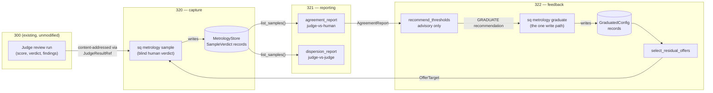
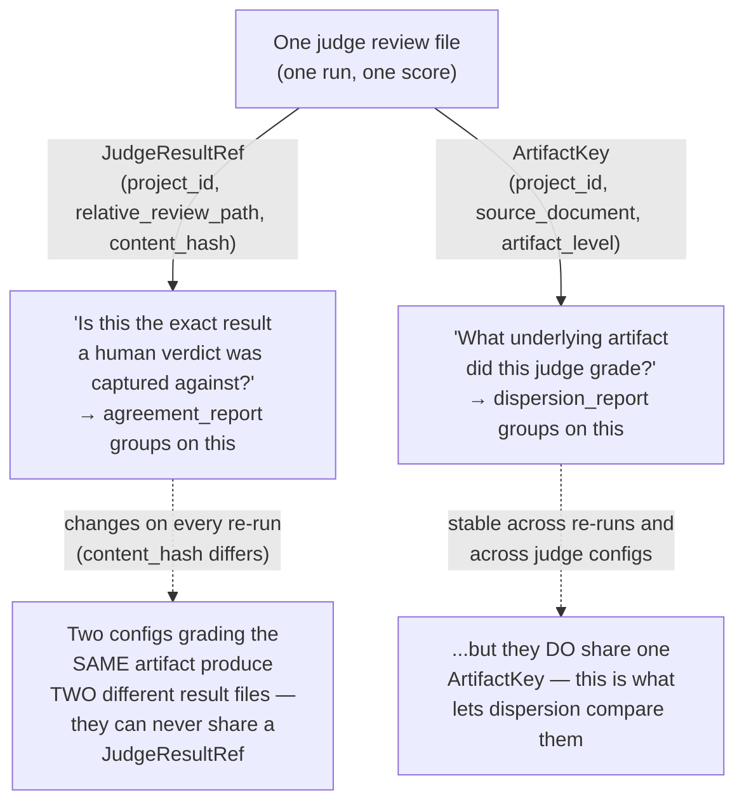

# Reference: Judge Calibration & Quality Metrology (Initiative 320)

Read this first if you are picking up initiative 320 without prior context. It does not replace the architecture doc, slice designs, or DEVLOG — it tells you which of those to read for a given question, and defines the vocabulary they all assume.

**Why this file exists:** a documentation audit of this initiative (20260726) found that a reader had to cross-reference the slice plan's checkboxes, each slice design's own frontmatter, and DEVLOG to get an accurate current-state picture — no single file could be trusted alone. This file is that single starting point.

## Current State (as of 20260726)

| Slice | Status | Design | Tasks | What it does |
| --- | --- | --- | --- | --- |
| 320 — Metrology Data Layer & Sample Capture (keystone) | **complete** | [`320-slice.metrology-data-layer-sample-capture-keystone.md`](../slices/320-slice.metrology-data-layer-sample-capture-keystone.md) | [`320-tasks.metrology-data-layer-sample-capture-keystone.md`](../tasks/320-tasks.metrology-data-layer-sample-capture-keystone.md) | The store, identity derivation, and blind human-sample capture CLI (`sq metrology sample`/`list`) everything else builds on. |
| 321 — Agreement & Dispersion Reporting | **complete** | [`321-slice.agreement-dispersion-reporting.md`](../slices/321-slice.agreement-dispersion-reporting.md) | [`321-tasks.agreement-dispersion-reporting.md`](../tasks/321-tasks.agreement-dispersion-reporting.md) | Judge-vs-human agreement and judge-vs-judge dispersion, per artifact level and judge configuration (`sq metrology report agreement\|dispersion\|trend`). |
| 322 — Calibration-to-Threshold Feedback | **complete** | [`322-slice.calibration-to-threshold-feedback.md`](../slices/322-slice.calibration-to-threshold-feedback.md) | [`322-tasks.calibration-to-threshold-feedback.md`](../tasks/322-tasks.calibration-to-threshold-feedback.md) | Advisory threshold recommendations and graduation tracking (`sq metrology recommend\|graduate\|offers`). Terminal slice of the human-oracle chain. |
| 323 — Audit-Oracle Data & Variance | **not started** | — | — | Different oracle (tech-debt-audit), shares only 320's store/trend spine. |
| 324 — Audit-Oracle Intervention | **not started** | — | — | Depends on 323. |

**The human-oracle chain (320 → 321 → 322) is done.** 323/324 (the audit oracle) have not started. This is why the parent architecture doc (`320-arch...md`) and slice plan (`320-slices...md`) both carry frontmatter `status: in_progress`, not `complete` — the initiative as a whole is not finished, even though three of its five anticipated slices are.

**Authoritative status source:** each slice design's own frontmatter `status:` field (`complete`/`in_progress`/`not_started`) is kept accurate per-slice. The slice plan's per-slice checkboxes (`320-slices...md`, "Anticipated Slices" section) are also kept in sync. If either ever disagrees with this table, trust the slice design's own frontmatter and treat this table as needing an update.

**For chronological narrative** (what happened, in what order, what broke and got fixed along the way): read `DEVLOG.md`, filtering for entries dated after 20260717 (when this initiative's architecture doc was created). Each of 320/321/322's implementation phases has its own dated DEVLOG entry.

**For a user-facing summary** of what shipped: `CHANGELOG.md`'s `[Unreleased]` section documents the `sq metrology` command surface from an operator's point of view.

## Data Flow (320 → 321 → 322)

**Reading this diagram:** the only loop is graduation → residual offers → back into `sample` — this is the "graduation is not a one-way door" guarantee (322): a graduated judge keeps producing sampled data instead of going dark. Everything else is one-directional. `recommend` and `dispersion`/`agreement` never write; `graduate` is the initiative's single write path outside of `sample` itself.

## The Two Join Keys (do not conflate — this already caused one real bug)

Two different questions get answered by two different identity keys, and confusing them is exactly what 321's design-review F001 (a FAIL) caught before it shipped:

`JudgeResultRef` answers "which exact result" (agreement's join key — correct for binding one human verdict to the one result it was graded blind against). `ArtifactKey` answers "which underlying document" (dispersion's join key — correct for comparing *different* judge configurations against *the same* artifact). Using `JudgeResultRef` for dispersion (321's original F001 bug) makes cross-config dispersion structurally impossible, because by definition two different configs never produce the same result file.

## Where to find the authoritative detail on a given question

| Question | Read |
| --- | --- |
| Why does this initiative exist / what problem does it solve? | `320-arch...md` — Overview, Design Goals, Envisioned State |
| What are the five slices and why split there? | `320-slices...md` — Anticipated Slices, plus the "Notes" section's design-boundary rationale |
| Why content-hash fallback instead of a 300 write-path field for version identity? | `322-slice...md` — "Version identity — the content-hash fallback ships" under Technical Decisions |
| Why does `template_content_hash` exclude the `judge:` threshold block? | `322-slice...md` — "The hash must exclude the threshold block — or the loop destroys its own evidence" |
| Why is `GraduatedConfig` version-scoped (keyed on the full `JudgeConfigId`, not just template+model)? | `322-slice...md` — "Graduation is version-scoped" |
| Why does dispersion group by artifact identity, not `result_ref`? | `321-slice...md` — "Artifact identity vs. result-file identity" (see also the Glossary entry below — this is the initiative's single most-easily-conflated pair of concepts, having already caused one real design-review FAIL, F001) |
| What actually shipped vs. what the task file originally said? | Each task file's own inline corrections (search the task file for "correction" or a dated addendum) plus the matching slice design addendum of the same name/date |
| Full command reference for `sq metrology ...` | `CHANGELOG.md`'s `[Unreleased]` → Added section, or `sq metrology --help` / `sq metrology <command> --help` |

## Glossary

Terms are defined once, here, in the sense they carry throughout all three slices. If a slice design's prose seems to use a term differently, this file is not authoritative over that slice design — flag the discrepancy rather than assume either is wrong.

**Artifact** — a single reviewed document (a slice design, a task file, an architecture doc) that a judge template scores. Distinct from a *judge result* (the persisted score/verdict for one review run of that artifact) and a *sample* (a human's blind verdict captured against one judge result).

**Artifact identity** — `(project_id, source_document, ArtifactLevel)`. What dispersion groups on: two judge configurations that both graded *the same artifact* land in one dispersion cell, regardless of which review file each one produced. See `ArtifactKey` in `report_models.py`. **Do not confuse with judge-result identity** (below) — this exact confusion was 321's design-review F001 finding (a FAIL, since fixed): grouping dispersion by judge-result identity instead of artifact identity made cross-config dispersion structurally impossible, because two configs grading one artifact always produce two distinct result files.

**Artifact level** (`ArtifactLevel`) — the grain a report groups on: `tasks_vs_slice`, `slice_design_vs_arch`, `arch_vs_concept`, or `UNCLASSIFIED` (the explicit fallback for an unrecognized review type — never a silent drop). Defined once in `metrology/levels.py`.

**Audit oracle** — the not-yet-built counterpart to the human oracle (slices 323/324): a different, automated way of judging judge quality, using tech-debt-audit signal instead of a human verdict. Shares only 320's store and trend conventions with the human-oracle chain — not a report path.

**Blind capture** — a human records a verdict against an artifact and its ground truth *without* seeing the judge's score/verdict/findings first. `CapturePayload` in `capture.py` deliberately excludes judge output by construction; `reveal()` exists only for optional post-commit display, never before.

**Calibration** — the act of comparing a judge's verdicts against human verdicts on the same artifacts to determine whether that judge configuration is trustworthy. Keyed by `(template, model)` — see "the dimensional mismatch" below.

**Content-hash fallback** — the version-keying strategy this initiative ships (322): `template_content_hash`, computed at capture time from the resolved template's judged-behavior fields. The alternative considered and *not* taken — a coordinated write-path version field added at 300's judge-result write site — remains 320-plan Future Work #1, still open.

**Dispersion** — how much distinct judge configurations disagree when grading the *same artifact*. The judge-vs-judge signal (321), as opposed to agreement (the judge-vs-human signal).

**Evidence floor** (`metrology.min_evidence_n`) — the minimum sample count (`n`) below which a report cell is `below_floor` (321) and a calibration recommendation refuses to suggest loosening (322). Reused as one definition across 321 and 322 — never redefined.

**Graduation** — the operator's recorded decision (322, `sq metrology graduate`) that a judge configuration has earned enough evidence to move toward auto-gate. Persisted as a `GraduatedConfig`, version-scoped (see below). Graduating does **not** stop sampling — residual sampling (below) keeps drawing spot-checks from a graduated judge's unsampled results.

**Human oracle** — the ground-truth source for slices 320-322: a human reviewer's blind verdict, captured and compared against a judge's verdict. Contrast with the audit oracle (323/324, not yet built).

**Judge configuration** (`JudgeConfigId`) — `(template_name, model, template_content_hash)`. The unit calibration and graduation are keyed on. Two records with the same template name and model but a *different* hash are, by design, different configurations — they must never be pooled or cross-matched. This is what "version-scoped" means throughout the initiative.

**Judge result** — the persisted output of one judge review run (score, verdict, findings) at a specific file path. Content-addressed via `JudgeResultRef` (`project_id`, `relative_review_path`, `content_hash` — a hash over the judge's *output* fields, distinct from `template_content_hash`, which hashes the template's *input/configuration*). Judge results carry no id and are overwritten on re-run — the content hash is what detects a stale (overwritten-since-capture) reference.

**Model-dimension note** — the mandatory per-recommendation text (322) stating that a recommendation is bound to a specific `(template, model)` pairing, because 300's actual threshold config has no model dimension (only template/step). Never a footnote — every `ThresholdRecommendation` carries one.

**Residual sampling** — after a judge graduates, a `metrology.residual_sample_rate` fraction of its still-unsampled judge results are offered (`sq metrology offers`) as ongoing spot-checks, so agreement data never freezes for a graduated judge. Selection only — never enforcement; nothing blocks on an unclaimed offer.

**Sample** (`SampleVerdict`) — one human verdict, captured blind, against one specific judge result. The atomic unit the store persists (320).

**Spine** — the shared persistence and trend-reporting conventions (`MetrologyStore`, the `MetrologyRecord` envelope, its `record_type` discriminator) that both the human oracle (320-322) and the audit oracle (323-324) build on. "Two oracles, one spine" is the initiative's stated boundary: oracles share storage/trend mechanics, never a report path.

**The dimensional mismatch** — calibration is keyed by `(template, model)`; 300's actual threshold config surface has a `(template, step)` dimension and no model dimension at all. A recommendation therefore can't be "applied" directly — the operator must choose model and threshold together at config time. Documented per-recommendation via the model-dimension note, never solved (a stated architectural limit this initiative inherits, not fixes).

**Version-scoped** — a record (most importantly `GraduatedConfig`) that keys on the *full* `JudgeConfigId`, including `template_content_hash`, rather than just `(template_name, model)`. This is what makes a graduation survive a threshold-only edit (which the narrowed hash treats as the same instrument) while correctly lapsing on a real prompt/model edit (a different instrument).

## Known documentation debt (tracked, not yet fixed)

- `project-documents/user/reviews/` and `project-documents/user/analysis/` each hold a copy of the 320 and 322 slice-design reviews with disagreeing `verdict` frontmatter. This is intentional for the `analysis/` copies (preserved as evidence of an issue to fix later — do not "correct" them into agreement with `reviews/`) but means grepping one directory for a verdict gives a different answer than the other. If you need the current, actionable verdict, use `reviews/`; `analysis/` is historical.
